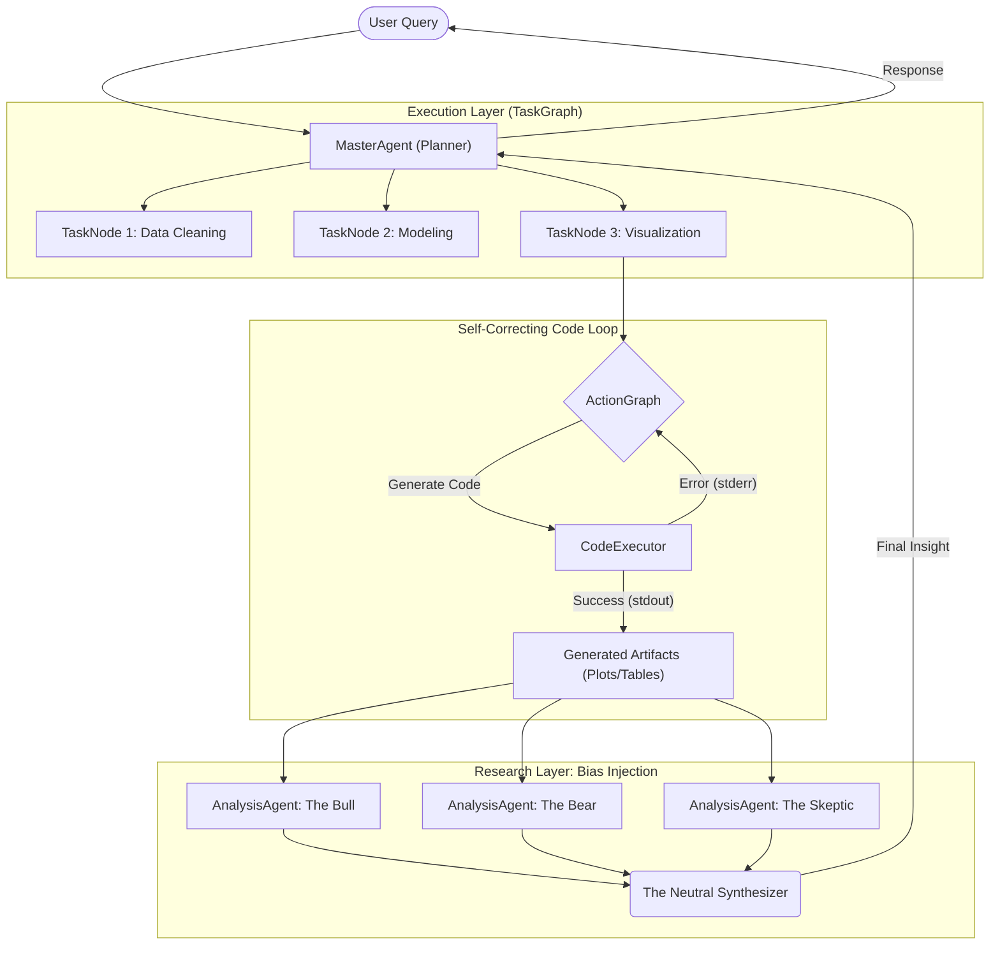

# Synthesizing Objectivity: A Multi-Agent Code-Generation Framework for Bias Simulation

> **Final Year Project (FYP)** > **Institution:** Nanyang Technological University (NTU)  
> **Topic:** Automated Data Scientist & Neutral Interpretation Workflow

---

## 📖 Abstract

Human interpretation of data is inherently susceptible to cognitive biases. While Large Language Models (LLMs) act as automated data analysts, they often mirror user biases or training artifacts. This project introduces a **"Bias-Contrastive" Agentic Framework** that goes beyond simple text analysis.

The system utilizes a **Hierarchical TaskGraph Architecture** where a `MasterAgent` orchestrates specialized `CodeAgents` to generate executable Python code for data processing and visualization. The research novelty lies in the **Analysis Layer**, where distinct "Persona Agents" (Optimist, Pessimist, Skeptic) interpret the generated visualizations to force divergent viewpoints. These viewpoints are then mathematically aggregated by a `Synthesizer` to produce a bias-minimized, objective report.

---

## 📚 Literature Review & Theoretical Foundation

This research integrates principles from behavioral economics and cognitive psychology with state-of-the-art developments in Generative AI. The project is grounded in the following key areas:

### 1. Human Cognitive Bias ( The "Why")

_To solve bias, we must first model it. These works provide the theoretical basis for the "Persona Agents" (Bull/Bear)._

- **Kahneman, D., & Tversky, A. (1979).** _["Prospect Theory: An Analysis of Decision under Risk."](https://www.jstor.org/stable/1914185)_ Econometrica.
  - **Relevance:** Establishes that human decision-making is not purely rational but weighted by perceived gains/losses. This justifies the creation of specific "Risk-Averse" (Bear) vs "Risk-Seeking" (Bull) agent personas.
- **Tversky, A., & Kahneman, D. (1974).** _["Judgment under Uncertainty: Heuristics and Biases."](https://www.science.org/doi/10.1126/science.185.4157.1124)_ Science.
  - **Relevance:** Identifies specific heuristics (representativeness, availability, anchoring) that the "Skeptic" agent mimics to challenge data integrity.

### 2. Autonomous Agents in Science (The "How")

_Evidence that AI agents can function as independent researchers._

- **Wang, H., et al. (2023).\***["Scientific discovery in the age of artificial intelligence."](https://www.nature.com/articles/s41586-023-06221-2)\* Nature.
  - **Relevance:** Validates the concept of an "Automated Data Scientist" capable of processing information at a scale and speed unattainable by humans.
- **Park, J. S., et al. (2023).** _["Generative Agents: Interactive Simulacra of Human Behavior."](https://arxiv.org/abs/2304.03442)_ arXiv/Stanford.
  - **Relevance:** Demonstrates that LLM agents can maintain consistent, distinct personalities over time. This supports the architectural choice of using persistent "Persona Agents" rather than simple one-off prompts.

### 3. Bias in Large Language Models (The Constraint)

_Acknowledging the limitations of the tools being used._

- **Navigli, R., et al. (2023).** _["Biases in Large Language Models: Origins, Inventory, and Discussion."](https://dl.acm.org/doi/10.1145/3597307)_ ACM Computing Surveys.
  - **Relevance:** Highlights that LLMs have inherent training biases. This research counters those internal biases by forcing _explicit, external_ biases (System Prompts) and averaging them out, rather than relying on the model's default "neutrality."

## ⚙️ System Architecture

### Architectural Basis: The Data Interpreter Framework

The core engineering workflow derives from the **"Data Interpreter"** architecture proposed by Hong et al. (2024). Specifically, this project adopts their **Hierarchical Graph Modeling** approach:

1.  [cite_start]**TaskGraph:** Decomposing complex user queries into a Directed Acyclic Graph (DAG) of manageable sub-tasks[cite: 16].
2.  [cite_start]**ActionGraph:** Further breaking down tasks into executable Python nodes[cite: 206].
3.  [cite_start]**Self-Correction:** Utilizing execution feedback (stdout/stderr) to iteratively refine code[cite: 17, 221].

### 🌟 Research Contribution: The Bias-Contrastive Layer

[cite_start]While _Data Interpreter_ focuses on optimizing code execution for accuracy on benchmarks (e.g., Kaggle, MATH)[cite: 18, 20], this project extends the framework by introducing a **Semantic Analysis Layer**.

Instead of stopping at the _generation_ of a chart or table, this workflow feeds those artifacts into a **Multi-Agent Debate System** to simulate and neutralize human cognitive biases in data interpretation.

